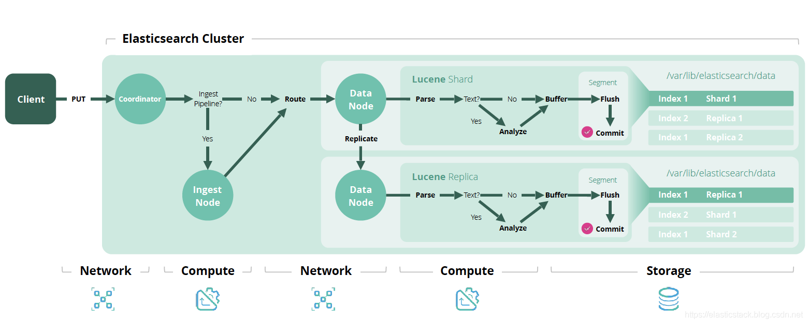

# A repo for ElasticSearch and Kibana testing

1. create `.env` file in the root folder

```
# Password for the 'elastic' user (at least 6 characters)
ELASTIC_PASSWORD=

# Password for the 'kibana_system' user (at least 6 characters)
KIBANA_PASSWORD=

# Version of Elastic products
STACK_VERSION=8.0.0

# Set the cluster name
CLUSTER_NAME=docker-cluster

# Set to 'basic' or 'trial' to automatically start the 30-day trial
LICENSE=basic
#LICENSE=trial

# Port to expose Elasticsearch HTTP API to the host
ES_PORT=9200
#ES_PORT=127.0.0.1:9200

# Port to expose Kibana to the host
KIBANA_PORT=5601
#KIBANA_PORT=80

# Increase or decrease based on the available host memory (in bytes)
MEM_LIMIT=1073741824

# Project namespace (defaults to the current folder name if not set)
#COMPOSE_PROJECT_NAME=myproject
```

2. Run `docker-compose up -d`
3. Access http://localhost:5672



- [Start ElasticSearch and Kibana in Docker](https://www.elastic.co/guide/en/elastic-stack-get-started/current/get-started-stack-docker.html#run-docker-secure)
- [How to search in PDF and Word files](https://www.cnblogs.com/strongchenyu/p/13777596.html)
- [A Elasticsearch UI](https://github.com/mobz/elasticsearch-head)
